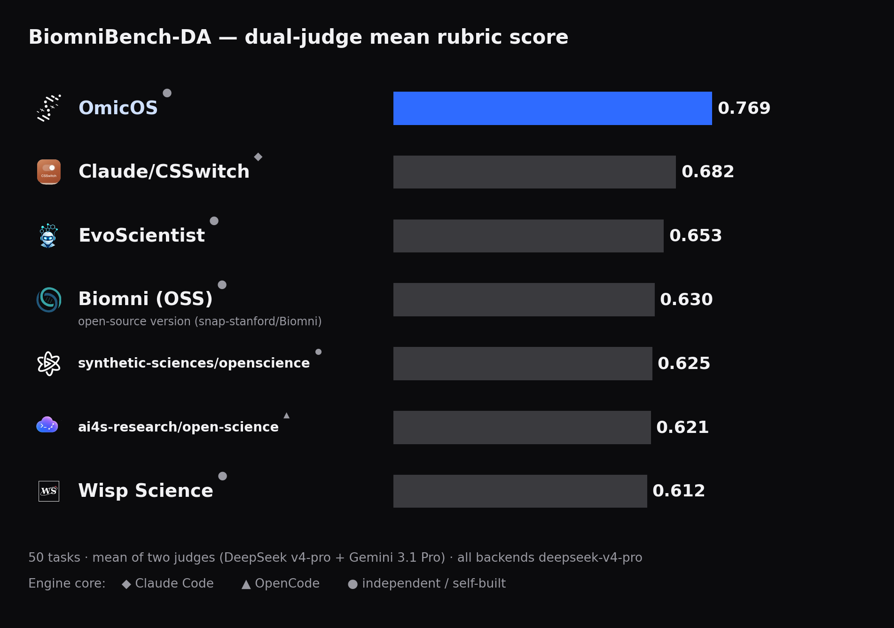

# BiomniBench-AI4S

[English](README.md) | **中文**

[](https://huggingface.co/datasets/omicverse/BiomniBench-AI4S) [](LICENSE)

[![OmicOS](https://img.shields.io/badge/OmicOS-0.77-2f6bff?style=for-the-badge&logo=data%3Aimage%2Fpng%3Bbase64%2CiVBORw0KGgoAAAANSUhEUgAAABoAAAAaCAYAAACpSkzOAAADnElEQVR4nKVVTWgkRRR%2B1T2zmXWyiQYXcY2u4M0fxGUD7sWgBw%2BLB1mji3pbD3tRL4KweIiCV0%2Br7B40LrIozEFFFxHEJB4E0TkGggNDYDCQZDo9lZ6q6qpX1fO8VGln2cSe%2BC4N9ep933vfe%2F0KoKIRUUxEtUP8rPxVSl1USr1ePhvLiIgRUdxut%2BuI%2BLO19ibn%2FBHvqxNRnGXZSfK2s7Nzf1XgyGf4slLqYul8AhFvBkAp5VzJVzfGfGSMud7pdCYqVeQlY3me%2F0BE5Jz7LcuyZ4I%2Fy7J5RLyRZdll59x3Qojz1fW5Q0UbGxsNrfU7RVHkRETW2k%2FLsnDO55xzhogIEb9YWVmpEVEdAKr3p9PpTIWAfr9%2FyhhzjYioKAqltX6XiKYAALa2tu4zxlxHxM99kpUkiwAApJRPO%2Bf%2BQsTlbrc7HfxCiDPOuWUiot3d3ceONFmeqOaJLoeGJ0ky66euHu4NBoOHS6NdI6JjIcmqRIyIWK%2FXO46IV4wxrxBRdBtodcD%2Fa4z9q1ie55e01hd8EvukPDSjMNpa67edc3%2FmeX7Jn0dSyrOc85mFhYU4SZIpX90vo9FoXgjxLGOMDq04%2FPn%2BWwMAsNb%2B7kf6V%2B%2BLpZQvaa2XtNY%2F9vv9U7djjC0NAIBSah4Rv1JKnQuV%2BvPXEPEbpdTVNE1P%2Bx4euA8BAFgIzrLspJTyQrvdvusOe4oJIZ7f3t6ebLVasZTyAQCAJElmOef3VK7GyzIppXzLWvtHnucf%2BvMGEcVhtyHil6WYSjJFAAD9fv8E5%2FwsY6xgjIlms3nVGHMriiKmlHoPAAxjrAAA6%2BManqTmm87%2Bk5CIWJIkU1rrJaXUJ0Q0QUSN4E%2FTdDqA9Hq940qpc61WK64EfpAJIZ5cW1s7FhIgoolyQp5sZjgcPn4kAg904MyHkU6SZNY5l45GIxoOh88FXxX8feD%2Bj44BADjnM4j4mdb6vO9dUavVGgBwN2MMoiiaBABYXV09mnyBME3Th6y1u37Kbg2HwycAAAaDwZm9vb0XAPavnyqgMQCA1voKIn6bZdmjwdftdqeNMe8XRUFERMaYj9fX10%2F4uPEqCesGEd8Mz4G19ppS6sFwJ03T04h4wz92Vin1alhV45KxAGitXfKAI2PMB5ubm%2FeGe5zzOUT8SQjxRlmNccn%2BGQwhxFPOue99f5YXFxej8mN3FNunsydjfguAlPJFAIiazebXvuoIAAgAiDFG4xD9DUkcRNfiS6nLAAAAAElFTkSuQmCC&logoColor=white)](#) [![Claude/CSSwitch](https://img.shields.io/badge/Claude%2FCSSwitch-0.68-555555?style=for-the-badge&logo=data%3Aimage%2Fpng%3Bbase64%2CiVBORw0KGgoAAAANSUhEUgAAABoAAAAaCAYAAACpSkzOAAAFV0lEQVR4nKWWX4icVxnGf%2Bd855vZ2dlkt2abxsXWWspW24tUKBWqsFshKoI3mhSKihcK3ipe1ZtxLtQL7wRRsCLqlVlFRBQUbLIihayRhqRdGlpqWtpN4ybZSTa78%2B%2Bc5%2FXifDOzmy5e6Adn5pzDzPO8z%2Fv3gz2PmTkDx%2F%2F5GDiz%2FThhQoJzzhnApR9941MMB8spxtkUhczyjySEQGBmgJBAEh4oQ9FJZf2v7rnnX8BlwvxVWW9mzjlnF3%2F63H1ue%2BtXdacT3oQkMMPMMBlmynszUHVvwmTZGDOSQU%2FuT%2B7I4S8%2F9a2f3cwCyK76Tqvllh%2Bkdvjf76zOlfbkjdu7EajAK2AzTBOiyd3krIr0fdO10Bmyemjxsyf%2BsPH11G5j%2FmyrVbTbbc1ce%2Fsrs8Ge3OzsDMwsKClIeZlSUEr7ziYFMwuGBZmCqjtM4frtnUHTpaWtV%2F%2F4bLuNzrSWirC5vm4Aqd8%2F2ZPJpGKv1aaEsvETJYClROz3wIwiBMAhy66WzA%2F6fSm5LwC%2F3Fw%2FauGZlZUEkOLw6NDwSklQuUKCxiyhOYt3bpwUGg6hCMx%2F8BFid4fNl9dgp5ODkV3shpiXmAd45dEVm2RdSiYcSqk6R2jeQ3N%2BgcJV6iolNGZY%2FPzXmFl4CICNC3%2Fn4s9%2FALsdwOVYOkPRNML3o02KQimNVxKUM7N4RIyRFCOWRP%2FONrOLx5lZeIhh9w5xsMvC45%2FgnsXjDHt9pIyTUkJK41qaKFJCibEiWa48pYRJYGBOGWBci1XwgJE3XBKWhGFUUPsVSRVIUl6DPoPtWxg%2B14mEUiTU6my89CKdq29RNg4R6k3evrTG5ivncc6jGJESko1s2K9IMaJiosgMetc3AKg1Z8GNuoHHdrc595PvMrd4nNjb4dr5v%2BE6m3hfxQdQVWPvJUpCtpcoF%2Bidd%2F6FCzXwvuoGAhxxOODK%2BhrIqJUB5z2qgM0M88a43bX3xiilu4hGChxp0APlyh%2B3HqBRn8Kw7CbA2NslDB3kupRy81TKRZfiAPAoDsAXKEZwVUirehn2%2Bzjvq7QXzntcESoiDiaSUiaSUBwy%2F%2BgT%2BU9K%2BLJO6ncJzcNcu%2FAisd%2BlefQDNI7cx%2B2NN9FwyOyDi3SuXKZ3awvcKIEOUhSFvEiDAaExTePeBTYvrXHkwx%2BlbB4i9rv4UONDJ04yNTfP9tW3KBtN5h5%2BjN3NqzSPPUDz2P28%2FueVsesOzDpTIpkwHP0729x68zWaxx6gc%2BUyjfn309%2FuUDaadDs3qB2aY%2FfGNRyOMN3El3VuvnE5x9QXWExVd5%2FMvjAaTmYMzHIonS%2B4%2FupLSHmY6LWXszGjJFHC%2BVC5XJO4Ab4IiJwzwkUAWuDPtpYKADl3PnjnlEwyw4U6vjaFK2v42lRe5RS%2BVqeYauJCiQslvlbHl%2FV8LsoqW6XCOWeOfwAsn13yfpllAZgPP9wd2tA5Qh6YVWLIqpUnrslyP7T999IorZHHlTtDdQe1%2Bo8Bd3Z5VXmUt1retdv69Ref%2BtKU4i963a5PRnRFEUY1NS7EyoeWP8buBCPFGJ3k681pdYvy2a%2BurP3GWnjXRuNonT51qnhmZSX9%2FpunPjNdC7%2FVra3pra2bSErk4O0DZ0Satw7n%2FeG5Wdc4uqBhMXXyc997%2FnetpaXQXl2NcNer1ZlWKzzdbsfXL557YvjuG98f9vufbEzVvB%2BRjKD3pC3OAY7uYECoT50r773%2F2w8%2F%2FvEXzrSWwtPtTPIeor3KAC7%2F8y8fUa%2F%2FmEUdc04LShqYORkK3hehwJURXa3V6u9aEdYf%2BdinL9yN8V8fM%2FNm9j%2B9SJ4%2Bfbo46P4%2Fo94Y9e%2FzC5YAAAAASUVORK5CYII%3D&logoColor=white)](https://github.com/SuperJJ007/CSswitch) [![EvoScientist](https://img.shields.io/badge/EvoScientist-0.65-555555?style=for-the-badge&logo=data%3Aimage%2Fpng%3Bbase64%2CiVBORw0KGgoAAAANSUhEUgAAABoAAAAaCAYAAACpSkzOAAAF9klEQVR4nJ1We1BUVRz%2Bzr3Xu8siC4LQAxUxwhf2VNPBCdHQytp0anMaKfORkzmWOpNjzyvZ23KyGhl7WGrT1FKWaZCloqaYIoJB6kJYuzxcYBeWfdzdvY%2F99YdSJGDk9985557vnu87v9%2B9H3AFkIg4AJAk4mxEfNf4iiDRBRIAICLGALzuCyx6ozP41JXwsX49RcRExuhOX8juErj0u5xey2lT5OA4DMyIFfkZqq4fW5OaeJiIGGOMeqPoIZmIGAD85HKNOODy5gHAkooKQSFiiiu0JNgkzwwQ13Yzi18fw1G2pim7lSg35t2mjkUX9%2FfDRiJGRIxsNv6JYOj0IiJa0dLxQNfy2zV1GdvPtI0EgNdrWxZIthqxa%2B1DV2AxcPH%2BLh62O3pMWIn4HYzps7zyR%2FsNwm1TW4OfjA2rdgVcFUXZvQM4RM1Gfp%2FA8GRQ1%2Fckq5597WJytoGxu5NqPesez7uuszfvesgsYkwfWVMjDmvwn1x%2B5Owdu9MGbejUeYcgCKtbFXbES3xlOCo8WeePbvBEGXMYU1bLjCXVBpTNn40dvPoJRa0qdLpTgQtV2cUr%2FMs2AMvtruGAaNXBOzpTUx9Zavd%2BXTgyoWZVnf%2F3z29MqAaAF%2F8Ijt8yNtEBwIHS0j3IzdUAwNzsczo1CKYYIgAo6E2RBDDGGBl0cVScoh8rHJXwpVnTTomaPhIAzvtD9daK1oV3lrsXHWv2Obs2SwemRgFg7tHm0fc3yvUO04Cs9cnJzQCAAhbtqWjtWoCI6VXtzk6Om7HijDcoQx8Xbfd9f9zhe%2FaqeNFyoF1LcYUhzrze3GJpDN63rKyx4KUHWZO1zJkqCMJNvzLnVxIRVwAQ%2Bijzv%2B0DgPyylozHKj2vLD3eOHRvrXt3bYTIEYySW9YorOrUhe0twT%2Fx9elrVla6J8471DwG%2BOercfliYIxAxHj76cYdR89sm64q8%2FmUpFltbQG5wx9U2uWw6pYV1SNHVEXT5PwUU9q60SmFnx0660kRNOXivfSvYcEYti7IDU%2F2Nt8UMRmfrj55VvN5PAM4juMHmGK5mIFGLtZk4ELhsFhX71RzEkTLMD5814bJw%2Br7tuqSPrLaiC96kOnTiu1zjI62D0YFHIM2vvcFmW%2BdxJJZBOmxKoyiALdqwHkxCY6j5bTcOoHODblFVwbGbCiZO%2B55thasexH0DiKOB7C03FVu2VxGEy1Ph9O3lGknOnVt8S67itkfash7V7tlS7X2c6us5p9s1TMeek259%2BUimnewIUrkHgIAkiT1cOrSCQIAP%2BMg%2BwPRuFgDBf5spCFmjqbfk8nE9OEQB1%2BDHGsWm5IcA7nNA5NAIJ2UQJQUINSnBqH7wApwRYDeoJGtuSM0Pn%2Fm7QbPzkPa%2BEddnCfRDGVnMcEfxDurPCg2x7EY57noyvwcbDzhE0Vv5BsgowkScQW9WNfbb4IxgEzWF%2FKWzpqxKSt7YgbXVKuonnY%2B4OsgDjquTRyM9PSrKSUzk99V0RhZ9ebHKxevn%2Fjpe5l3KyDC5XuoGySpVGAAps97YcKyHb93bDwlq%2FsbAqrdT9p5lbRWlbRKPykbq0NK1lNbFzL03T%2F9Qo0sDxv70Gs%2F3lawT99U1Rkpsbu1A%2BfatZKGiGLZ8ps%2B9OHCM7uOVGX1h%2BtS65hExKbsrYhrMJof12KTnnW2eeLeX%2FWMNub2XHbHfXnMJPKoqLTTtx9soxWvruGmT8rUIufd61MHaW%2FtGjHCX8C4aB89%2Bw9sNhsPIrb9x8OWrb%2B10ivlPlpTXK%2Bu%2FKo8hKtywsiwqlzWIyqSciMLC0tCb530KtvqQlQrEx2prFl2geNCzvgvRej676%2FZuiNzUNaE1fWt2gORgBLfVv0LivfUqjAmRCdnGQzjZ1lgNvH6zWnGH%2Fim%2BjfmTJl0mIjQV2boNZx0DxnP7atI%2B67UMXso55vzS8n%2BnFBIw9TZ084GDIk7p2ZnFK2bdkPF5X36D0iS9Hfc6kJ8Wvac%2BOFTlqTNn2%2FsdijOZrP1atf%2FfmGOVCoA%2Fw4cOaWlwv8p6b8AGhUdbyCvkL8AAAAASUVORK5CYII%3D&logoColor=white)](https://github.com/EvoScientist/EvoScientist) [![Biomni OSS](https://img.shields.io/badge/Biomni%20OSS-0.64-555555?style=for-the-badge&logo=data%3Aimage%2Fpng%3Bbase64%2CiVBORw0KGgoAAAANSUhEUgAAABoAAAAaCAYAAACpSkzOAAAHHElEQVR4nJWWbXBU1RnH%2F8859959yW5igpEXUV4MdAwyLsREim0jWkdtKRVxF2eK5SWQDkqMWCDSfrjc6Ye2gwgMUQwQ0mBfZLcVsExpHRHSOgPkBVALygyaRJMSQoDdbHb33r33ntMPIZGm1kyfz885v%2FO8%2FZ8DjGLhaJSP5qNLyUbzU0aDxCIRFwDNaWz8DphSJoSYSAAjousSdB5u9qRB1DEENAAJIjnyLhoNUrpr76M8x%2FcLrmmlSm4uiBgACRBBOi6sq30OQf7ZtsztrRUVTYMh6gyGIb4ORADkMKT%2BN6vVHP9r3O%2BHnUhYUogjEOKUEDLBOBsDxmYT6GFPYWGunUzCNTN74pe6X7xQU5McCfuviIYhDQ2Pqf7AEeIcTjp1wh4wq04%2Fu6ptpH9JXd14pnlXcE2r8RQUBM0rfS2i%2F%2FqCljVrem6GDYEIAL6xYH0gheysikPb3j%2FSuO8TT37BtGw8%2FvdTy54px4islx87plw5fpydN4wsAJTtrC9mAe8%2Bz62FJWZvT0sy2f9Q%2BLnn0kM1U27klGAYwvKwn4nu1P53%2FvjmPC03b5qdTA5IK7Ns4oK1M7WAf7Z0hEJCXHPgXGiaN%2B%2F84BMJRdu2eZpXV5wv3bHjUVPiHe9t40qFLbYZRCvD0SiPAS4NhTc1XDNTMjrUvv9XU%2B9vaHzdN%2BH2ynR3V2PzimXLpy7eGFd8uXlSCkjhQmRNG6AzUsrG9k%2F7dqNtl120fbvnYnW1Nat2d5G3INjKFCUv2x%2Bf27Jy5YlwNMpZ%2BXEwABASGyGRAAAJmiGFS9yv%2FmVcaHkxUz15Tjpx2c0MdLpWOs4UTVV8gTLu8b46ZVrhialPrnvgYnW1NUlv8J5Zs%2Bqik0ptVnLzQFxdP5Rq1tRkOOPnV%2FoZ508A7LMb2SgUjgPpwlS8WsJxrQedVOJu15cOcVvMtNMDj2fTid8K23K55i2Bx3d0SmTdok5juQldZyJxvc660ptgqvq9e3fuvD0WibgKAKieW0KKL%2BCzU%2F0uAEgJASK4ljW262RdN06iGwDu27u3tLWiogUkuyrd1qN%2FeypWD5FpYJpnspCeP0wJb%2FhWu2E0twF9ZQ373vONG7vQtbJlAA4wAOAki4mrEgzXAICk7GGcA2DTARDCYT6rtnYSTDMDKRHa%2Burck5uO5Xf%2B6dfHSROPCNvs5JpPBaiuqKrKA4CIURtxDgEEAQzWRxLLBxFJKbsGIxJnpOuCGJsfjkYZwmEwzifmXL78yZzduwsUr2J%2FaKzvvXdrbWjJG7%2FsEClzqbAtwT2%2BkNPj%2ByEAKSyrVwoJhUMMg4D%2F1CY3k43aiYRQg8G7O1KpFYhEXMZ5vMkwnKxtT2em%2F0KxrmuaT%2FEZmzaJjsNbm1wne5SpXkmMPTVYfQ4QQJLJYRCD7IOUkoEmAEDbmp%2BccrP2QaYo4KrnldLX9zzcUll5LlRfX0iCy%2BbqZ%2Fr9Y%2B%2BYQYx9EZ4xg6DrjCDfhpQEonsAgCl8IhHBFoIDN9RbCOdj1zZJSpQNDSEzxfN2ov%2BbSiBnPICDZY1vVJsfnt1%2FdsuWUwDgEImzlZVdzUPSEv5pu3BtkJAFAECMBaSQYKBrwyDLSn5ETP0X0zyhOxa9MOOLe%2FI%2BPrl6Wfd9e%2FZ8Hxl%2BWAkEJohstt4XKvnx%2FQ2NvxO21WJeG%2Bgrqau7kzyeEBj7rHd%2Fa4%2FmBSQRDc4i1Gz8ukC6%2FwQAsPJyXbl0eFcaUv5e8QY4I3U9DENMWqp7W1euPJPpvfSAO5A8ACnhyc8vV%2FPzd3Gv%2F7R%2FfME%2FFa%2F%2FnK%2Bg8JAnqN4qUnaAKSpoMAKCkNNFOvVuS1XV1XA0ylnTgxAASAqn1h6Ip1RvzpIpC198pLPRMCct1b0frF3bcWLJj5500uZ8Ox4%2FYCeTV5iqkRII5KnBYCB79Vrqu088%2Fb6Sn%2FMDYoqEEOcASCnFBBfSGGqwQfUORzliEXfyog3r1GD%2BZtdMXRJW6vGOA1s%2FKA7rWmExRJNhOAAQ2r69UAkGp3HwWwDAsc0Ll98%2BbWqBMR9xb06%2B1dcbufOFb7eZHYnK1lUVL%2Bm6zgzDEF%2BuiXCUIRZxJy3a8KYnb8xiJ53ocd3s8s7Yy38FgHJdV64Aw2vhJqMpkY3vKt6chxxzoKs9%2Bulds1%2BbN5P6%2BcW2msr%2BG80lb158BF2n4vNQMjD3KTl5i0XWhHTsva60d3TGXj47AoC7Fm%2BYK6FuYao2R0oBJ5Ne2PnW5oM3xmb0VQ4Ak8Mv1TBF%2FbnqDwaddBKuazcziTYJ0Q2wPBBKiNg87g2QyGaksNLPt7%2B1pRbhMEcs5gKSbhaCr%2Fqc0NAinBheW6Qx37OAfJp7A%2BOZogGD3QspXLiZAUgp%2FuG45qbPY1ve%2BxLyVZf%2BL7vpUNFjVblOMDCLMRQL170NxAQRu%2BTCPv15dPPpkf7%2Fv%2Bk6Ky%2FXv%2FbvNwwZxf4NN7tymEU8nK8AAAAASUVORK5CYII%3D&logoColor=white)](https://github.com/snap-stanford/biomni) [![SynSci OpenScience](https://img.shields.io/badge/SynSci%20OpenScience-0.63-555555?style=for-the-badge&logo=data%3Aimage%2Fpng%3Bbase64%2CiVBORw0KGgoAAAANSUhEUgAAABoAAAAaCAYAAACpSkzOAAAFsklEQVR4nK1Wb2wT5x1%2BXvvyF2UpgxCkMRhTpCGthYygCjbGpqVSmIQqTZVXPoBQqmpjY6JaNw0sbTJC2tJ96diEtGWoSJvGgixvVSE1SRA2rbEym4ujeclwQhyHm%2BM4dozPsXPHOYmffdgdDQGy0u0n3Ye7373P8%2Fvz%2FN73BT6hkbQ9y%2F%2FSxwAUNpuNW7durb158%2BZrkiS9MDk52SOE%2BJCkTQhR%2BaTBriayAbDH4%2FFemlapVBgOh4%2BYfvv%2FTOL3%2ByUA8Pmuv0KSqqpe6Ovre1HTtMzCwkLx4sWLnyVpk2W5iqS04lmbnKRt1YJqAMhms%2B8bhrF8%2Fvz5bQAQCAQcJDk1NfX2GljimRwul%2BtTuq4b2Ww24Ha77SRrANgLhcI%2FdV3PHTp0aGMoFNozPT39xszMzO8URemWZdnxREzrg9fr3ZlIJM4Ui8V35ufnL46Ojv7U673STpLT09OnAUAIAZK2ycnJn5BkqVTK8gl29%2B5dp4ltBwDJ7XbbAVSCweA3WltbvfX19TXlchnV1dXYvHnzbD6fWyCJe%2FfuqXfu3PnuxMREUAgxcvXq1Xe3b9%2F%2BS5IPUqnU2%2FF43G8YRlSSpOrdu3d%2F0NTU9D0AXTabbRmAkBwOhxBCsFgsHq2vr6%2BORCLfvHLlykhzc%2FO69evXL%2B3du%2FdVIQR0Xdf27dv3hx07diCdTvdGo9ELHo%2Bnw%2BFwDKwut6Zp1ZqmKQBQqVSEEAIgKQFAOp3%2BDcnly5cv7wIAu%2F0%2FwhkZiV4gydOnT7cMDw%2B%2FWCgU%2FmKV5%2F79%2B38NBAL7V5YoFou5SDKRSHQCHykXZunQ29vbahhGRVXVfxw%2BfLiZpPD7%2FZKiKL8lyVwudyMQCHwLALq6uj6fSCT%2BZBGm0%2Bl3nE5nk8%2Fn%2B8rS0hLz%2BXz04MGDNaaKPxKEFU00Gv2ZGc2Q0%2BlsBoBkMvl7a0hJUtf1sVQqdQQA%2Bvv7n89kMgNmIHFVVbMLCwvZ69evf8nEfXybssiSyWQXSc7NzY0MDAzsiUaj3ZVKhW1tu43Ozs6lQkGlObwpr9e7EwCGh4fPWdnFYjHPSrwnmbCcijJ1myRDodAfZVl2kuSePW3l48ePLxqGQV3Xy6lU6ufbtm2rlWX527quz2qaVsjlcqMkqSjKW08ls9IcGRl5kySTyaQPQI2iKK%2BRXCqVSpYAhgYHB3cCQDweP2vOUsHn83Xs2rXruampqQhJRiKRHz1GZu7CuHbt2hd1XV%2Ben58fO3XqVCMAyLJ8yAT719jY2DEA8Hrf2zk3NxchyUwmc9vtdr9g4oiTJ082l0qlMcMw9J6ens890iuLNZ1O95DkjRs3DpAUsixX9fX1tcRisdcBVO3fv399Op36tdWP8fHxXwB4rOG3bt36KslKPB7%2FoYkvSS6XyyaEWD5x4uiGhoaGV7LZ7M329vYPzTWLACbOnTtXVBTlrY0bN75ZV1eHbDb7t2g0ekKSpM%2BoquovFosf5HK50VJJVerqGrBp06aXAYjFxcUqi%2FzhwVdT0yQA2Ovqap8bHx%2F%2FWrlcrlu3bl3bhg0bXmpoaPg6AJRKpXAkEvlVW1ubB8DSxMTEkcbGxgONjY0HtmzZ8khWs7Ozf%2B%2Fv7%2F8zSXHmzJnKI0KwmrvSNE0zcrmcJxAIfOfs2bNfsEpB0jY7O%2Fv%2BgwcPDI%2FH0zE6Onq0WCz%2BQFXVE4ODgy%2B3tLTUWH1brToBAMFg8MvhcNgZiUTeCAaD7S6X69MAJFVVE5lMZhCAjWTVsWPHanVdz%2Bfz%2BduPSXgV5sd2%2BP1%2BaWZm5l2S9Pv9LwFAKBRymDPzY7fbbU8kErVcccI%2BlcQy83B7uMDv90tCCFy6dGmHpmnlYrE4Ew6HX9U0La5pmt7d3b1VCAGXy%2FVMt6KnZWoDgKGhoU7DMB72T5bl75v%2B%2F3pBWTu9VWRCiEpvb29rU1NTh6qqgx0dHf%2FfK9dKsrXe17J%2FA3blSeWxYencAAAAAElFTkSuQmCC&logoColor=white)](https://github.com/synthetic-sciences/openscience) [![AI4S OpenScience](https://img.shields.io/badge/AI4S%20OpenScience-0.61-555555?style=for-the-badge&logo=data%3Aimage%2Fpng%3Bbase64%2CiVBORw0KGgoAAAANSUhEUgAAABoAAAAaCAYAAACpSkzOAAAEWUlEQVR4nO2WS2heRRTHf2dm7k3u17zamBIf2C602ogPqlYtPmgXKiI%2BwC8gCG5EQVeuVFBuI%2FjAKkJFUCioIAhflLpRfFSL6KaLtgurVktbUBrbxLZJ7vfKd2fmuIjW2MZawZ3%2Bl2fOnB8z5%2FCfgTNUnqtRVZPnuTnTPf9ItZpaRWVhTHM1muu%2FB8wXFNtTO3T%2Bdx8cvvTgjoPDJ4B65jD3Vwuaq5ExiZ9tmh4dzLJHdcpeFme0IjPMHP6w9WWRFrmI7FJVIyLx70CyWLBWUzs6KuH9p6fz4SX9G%2Bea0O5EDEolswwPgevxrbLSvv2CO3s%2F375d3fr14s8YlOdqLgE3Oiadt8aO3jLYteyjmWPB%2B1IF1KRWpMuhieCHB1ySLe0cscsPXLj6rtWF1tTyDSpji59OFkLGfkt6%2FrH9%2FX3u7I8Tya4uZkslWItGUiOkonRZyAx%2BxTnONaX%2BbOmPvXrzYysmTq4DMDJSTb%2F9dryUhYtP5Icu7u1a9lRsmQ1SJsPtVlApjeAV0fmGOqDLKJVU6ElUB3ud9C3xxUB%2F3NawU0%2BsfeC870%2BCCaBSrdbs%2BPhoePyFo9dZ7f3QaTJwdBJCJ6hTFe0YnCo2gkOwQEoktUJPAolXXdolctFKS9LX%2BaVIixuvvX9wLzmy8BpNrVaND%2Bd7ehqx553pmAzsm%2FSdoZUdzQajHGkKDWA2KnWNFCFSD8psEAoPR2bgsttVLr416M59vlNvpGdJK9uCntojIyIa%2Bs%2B7rZmlK6Ya3jcwaQvknruV%2FqFIXZU5qzQQigh1rxReKXxkuiNoJTJZR46VpD9MxNiaq6z7ZMvPa2RMYq1WsydAAA3jrikiWvdgMuXT3Y7dB5TRuyI%2FTQuTTcPRltCKkZYqHVGONw1953i%2B2hZ5721L28EvLY1FG23PVK4EGPqmKn8CzSrd9Qht4EjTsO6qwMhK2Pyu4YrLPdevDaweCbTUMBuEQ8eFvuWBJ58Bt8QSM6XwUHil7qGu5hQjcAChK%2B7peKQZodTITBteGjf8OGm44HxPdy80S6UeDecOKavWKDZ4trxp2D9h6SRCE0UUM10i4L8GmLrkj245ECpZa2tjuntTSGwmIcad%2B6yxMVLpU7btStG2UrFK2Yncs1a57w6490FLu%2BEY7IdKCnOKH%2Bh27li7tbfUiR2qKgutSao1teOjEjZsnn7Ix%2F7XZicgtEovQZAICeAi2KhoKXS7SGYjzcKxJFVcFBIDfZlzy3oDzh3f8NxzQ9urVbXj4xL%2B5Ay%2FB294sXjEl13PlnNJX2iBiWAjmABO54ESQEvI7Py9pwYyBxVTHhZpPPz6y0u3nuwOi1rQ%2Bk0HVvhy8O5O011BkIrxqhJUkgg2gNX50xGNOhHpTrToNmFHEg5vfeOVVVOLQU5Rtab2tAl%2Fo2q19pf7T30mcjU3%2FTb2yxdMDeOLF5gcma%2FxxUYCIot4wv8C8jw3p%2BvD6fQPfzIbmZwcWvT5%2F%2B%2FpVw5rQFNK%2BLEKAAAAAElFTkSuQmCC&logoColor=white)](https://github.com/ai4s-research/open-science) [![Wisp Science](https://img.shields.io/badge/Wisp%20Science-0.61-555555?style=for-the-badge&logo=data%3Aimage%2Fpng%3Bbase64%2CiVBORw0KGgoAAAANSUhEUgAAABoAAAAaCAYAAACpSkzOAAADJklEQVR4nMWWz4scRRTHP6%2Bq2%2BmeRDEnIxpWEDTBDSERzWUhB0UF8ayL8aSg4tlDRFg9SE7%2BASYBwYviQRF%2FgHjxB4iyIGIcdUkQNYLoKmF%2F9HTPTNd7HqY7me3pkWRX9EHRVa%2Bqvt%2F3Xtd7VfAfiUwOzMw1dTsQExH9l7CuXATGnoiImtlhYB4YAW6bmApEwIqILNfY0SQhcAT4AfilIrJtGK7ADcBdwHI9ETUWZsB5Efn9Kgm2iJltAPsndU0iByRmJpV1V%2BpRc21CI%2FRt%2F8FExKrNAjAxnuy7eiwiKiImzhlAlmVToE2PLpsoEhpjbesDYmadMwv3PjsaDJ4QkTkzCyGELWnSRmRVPu0HijzPR2ma%2FgrcCKyKyMjMDpVleUsIIZjZUQU7%2BNii%2B%2FGDD98bmi0A33vvt4C2hc5V7SlgJY7j20TEVPVrVT2V5%2Fn9qnpCVdM4jo%2FFcTwKo9FHR598%2FNbFd958NRRFAuxifPpmExVF4USkzPP85crj6%2FM8fwDYDSwkSfJJCOHjTqfzBvA0MIzj%2BMsLvd4z2fr6PPATsNbEniJKkiSYmXS73Z%2BBc865F733d5rZC865ucFgcI%2BZFWbmgdPe%2B5Oqmt904MD7nW73rzRNz1ce2T8SASIitrm5eSSEcNY5tw8ovfevqGrpvX9JVT8VkeCce244HD6sqmecc3POuYdm4TYVAvQ3NjbmReSasiyfB65zzq2KyBqwHEXRtb1e70KWZXeHEL4Skb1Zlp1Q1XPAnxXOVP7Vtc6LSDCzReCLwWBwOEmSt6q5R4F3AQ0hHA8h3AF8rqq%2FRVHUEZGbGSfomvf%2B9QpnL3CfiLzWrHWTHg5UdbUoigedc%2Bv9fn%2FFe38siqJkOBx%2Bm6bp28AfVeLOkqm5JpEBUbfb%2FczM9gBpHMcGfCci%2FS0L2%2B8unWVAa2UwMxGRi8DFSV0FbHXZadvXhgczTl1t8dLSkjMzmQCwGrCtMS5Hl2pkmwe%2B%2Bj5S%2FcgdiZntMbPjtcEwHbpdwD4zqyv0di4%2BY3zx7Z6cqIlqwG%2BAg8Dt7Owqj4Gz29y%2FM5n13LrakLXh%2Fj%2FPrb8B%2BbSPr4EeBvMAAAAASUVORK5CYII%3D&logoColor=white)](https://github.com/xuzhougeng/wisp-science)

在**同一套生物医学数据分析基准**上对多个 AI-for-Science 智能体做**横向对比**,条件完全一致:相同的 **BiomniBench-DA** 任务、相同的 **DeepSeek v4-pro rubric 评审**、每个智能体都跑**同一个模型(deepseek-v4-pro)**。只有智能体本身不同——所以分差反映的是智能体,而非模型、任务或评审。

> **本仓库仅供参考与学习。** 它记录了对比方法、各家的驱动 adapter 和结果。`omicos` 后端依赖两个**私有**仓库(`omicos-core`、`omicos-admin`),因此 omicos 的运行无法对外复现;harness、竞品 adapter 和公开的 trajectory 才是参考材料。



## 排行榜

50 个 BiomniBench-DA 任务 · rubric 评分(通过 = 分数 ≥ 0.70)· 所有后端跑 deepseek-v4-pro · 同一评审。**均分**为主指标;上方图表画的是**双判官均分**(见 [双判官稳健性](#双判官稳健性)——两个评审都把 OmicOS 排第一)。

| # | 后端 | 引擎 | 均分 | pass@0.7 | 准确率 |
|---|---|---|---:|---:|---:|
| 1 | **OmicOS** | ● 自研 | **0.77** | **36** | **72%** |
| 2 | Claude / CSSwitch | ◆ Claude Code | 0.68 | 26 | 52% |
| 3 | EvoScientist | ● 自研 | 0.65 | 23 | 46% |
| 4 | Biomni (OSS) | ● 自研 | 0.64 | 23 | 46% |
| 5 | synthetic-sciences/openscience | ● 自研 | 0.63 | 23 | 46% |
| 6 | ai4s-research/open-science | ▲ OpenCode | 0.61 | 23 | 46% |
| 7 | Wisp Science | ● 自研 | 0.61 | 22 | 44% |

`◆ Claude Code · ▲ OpenCode · ● 自研独立引擎` —— 每个后端封装的底座引擎。完整表见
`reports/final/leaderboard.md`,图表见 `reports/final/leaderboard_{mean,accuracy}{,_light}.png`。

> DeepSeek v4-pro 输出双峰,单跑存在逐格方差。除 omicos 外每家均为单跑;omicos 对 **6 个高方差格**取其多次运行中的最优(纯单跑的 omicos 约 0.73,仍第一)。详见 `reports/final/leaderboard.md` 底部说明。

## 双判官稳健性

为确认排名不是单一评审的产物,每个格子都由**第二个独立评审——Gemini 3.1 Pro**在完全相同的 rubric 和同一条原始 trace 上重新打分(什么都没重跑,只换评审),再逐格取两评审的均值。

| # | 后端 | DeepSeek | Gemini 3.1 Pro | 双判官均分 | Δ(双 − DS) |
|---|---|---:|---:|---:|---:|
| 1 | **OmicOS** | 0.773 | 0.766 | **0.769** | −0.003 |
| 2 | Claude / CSSwitch | 0.678 | 0.686 | 0.682 | +0.004 |
| 3 | EvoScientist | 0.653 | 0.653 | 0.653 | ±0.000 |
| 4 | Biomni (OSS) | 0.635 | 0.626 | 0.630 | −0.004 |
| 5 | synthetic-sciences/openscience | 0.628 | 0.622 | 0.625 | −0.003 |
| 6 | ai4s-research/open-science | 0.611 | 0.631 | 0.621 | +0.010 |
| 7 | Wisp Science | 0.606 | 0.618 | 0.612 | +0.006 |

两个评审都对每家的全部 50 个任务打分(50/50 全覆盖)。

**两个评审下 OmicOS 都是第一**,且每家的双判官 vs DeepSeek 差都 ≤ 0.01——两评审高度一致,排行榜对评审选择稳健。完整说明 + 逐格分数见
[`reports/final/dual-judge.md`](reports/final/dual-judge.md) ·
[`matrix_dualjudge.csv`](reports/final/matrix_dualjudge.csv)。

## 各后端

| id | 底座引擎 | 来源 |
|---|---|---|
| `omicos` | 自研(omicos-core) | 本项目的智能体 —— 私有(`omicos-core` + `omicos-admin`) |
| `claude_csswitch` | Claude Code(经网关 → DeepSeek) | [SuperJJ007/CSswitch](https://github.com/SuperJJ007/CSswitch) |
| `evoscientist` | 自研 | [EvoScientist/EvoScientist](https://github.com/EvoScientist/EvoScientist) |
| `openscience_synsci` | 自研 | [synthetic-sciences/openscience](https://github.com/synthetic-sciences/openscience) |
| `openscience_ai4s` | OpenCode | [ai4s-research/open-science](https://github.com/ai4s-research/open-science) |
| `wisp` | 自研(原生) | [xuzhougeng/wisp-science](https://github.com/xuzhougeng/wisp-science) |
| `biomni` | 自研(Biomni A1) | [snap-stanford/biomni](https://github.com/snap-stanford/biomni) |

## 工作原理

harness 原样复用 **`omicos-biomnibench`**(公开)做 BiomniBench-DA 的数据装载 +
rubric 评审;唯一的 per-agent 代码是一层薄薄的 **adapter**,把每个智能体驱动到在
staged 任务工作区里写出 `trace.md` + `answer.txt`,再由同一个评审打分。任务与评分保持
单一真源,所以对比是公平的。

```
configs/backends.yaml     # 7 个后端:id、kind、model、engine
src/biology_bench/
  adapters/               # 每家一个 adapter(驱动 → trace.md + answer.txt)
  matrix.py               # (后端 × 任务)编排器
  prompts.py              # 发给每家的统一 OUTPUT CONTRACT
scripts/
  build_leaderboard.py    # trajectories/ → matrix.csv + leaderboard.md
  plot_leaderboard.py     # matrix.csv → 图表(深/白 × mean/accuracy)
  export_trajectories.py  # 抽取可发布的 per-cell 子集
  redact_omicos_trajectories.py  # 剥离 omicos 私有 agent/skill 正文
docs/running-competitors.md    # 从 GitHub 构建 6 家竞品的完整指南
docs/parity-caveats.md         # 模型 / prompt 口径偏差记录
```

## 运行

```bash
cp .env.example .env      # 填入 DEEPSEEK_API_KEY、各路径、HF_TOKEN
pip install -e .

# 一个(后端 × 任务)矩阵运行
python -m biology_bench.cli run --backends omicos,biomni --tasks da-4-1

# 汇总 + 出图
python scripts/build_leaderboard.py
python scripts/plot_leaderboard.py
```

每家竞品的构建/启动路径不同(有的要 Apptainer 容器绕 glibc、有的有无头 CLI、有的走
网关)——见 `docs/running-competitors.md`。

## Trajectory

7 家的 per-cell 产出(`trace.md` + `answer.txt` + `grade.json` + `trajectory.jsonl`)作为 HuggingFace 数据集发布:

[](https://huggingface.co/datasets/omicverse/BiomniBench-AI4S)

**→ https://huggingface.co/datasets/omicverse/BiomniBench-AI4S**

```bash
huggingface-cli download omicverse/BiomniBench-AI4S --repo-type dataset --local-dir trajectories/
```

**不进 git**(110 MB)。布局见 `trajectories/README.md`。omicos 的 trajectory 经
`scripts/redact_omicos_trajectories.py` 剥离私有 agent/skill 正文(仅正文,名字与分析
步骤保留)。

## 口径说明

- **模型固定**:每家都跑 deepseek-v4-pro(原生或经 Anthropic/OpenAI 兼容网关),偏差
  记在 `docs/parity-caveats.md`。
- **评审固定**:同一个 DeepSeek v4-pro rubric 评审给每家的 `trace.md` + `answer.txt` 打分。并用第二个独立评审(Gemini 3.1 Pro)交叉验证——排名不变(见[双判官稳健性](#双判官稳健性))。
- **Prompt**:所有智能体拿到相同的任务文本 + 输出契约;omicos 版额外多一段多专家编排
  说明(记在 caveats)。

## 数据集

BiomniBench-DA 是 gated 数据集,任务输入与 rubric 不含在本仓库;设置 `HF_TOKEN` 并见
`docs/` 的重建路径。

## 许可

MIT —— 见 [LICENSE](LICENSE)。竞品智能体各自遵循其自身许可;`omicos` 后端依赖私有仓库,
不在此再分发。
